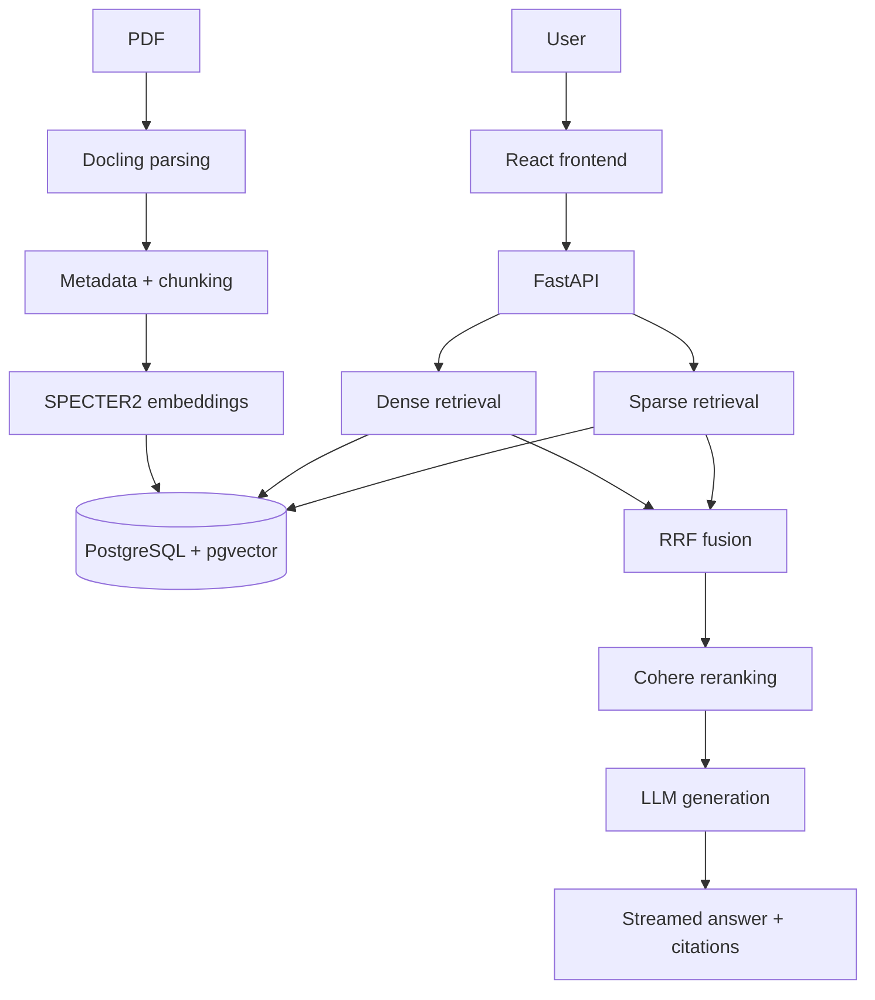

# Anthology

Anthology is a RAG (retrieval-augmented generation) app for asking questions over a collection of research papers. You upload PDFs, it parses and chunks them, embeds the chunks, and answers questions by retrieving relevant passages and passing them to an LLM — with streamed, cited responses. It's built with FastAPI, PostgreSQL/pgvector, and React. The more interesting part isn't the LLM call itself, it's the retrieval pipeline (hybrid dense + sparse search, fused and reranked) and the fact that it's actually evaluated — internally, and separately against a real external dataset (QASPER) — with the results reported as-is, including the parts that aren't flattering.

## How it works



## Results

**Internal benchmark** — 247 questions generated from the project's own corpus, hybrid retrieval + rerank:
Hit@1 = 77.3%, Hit@5 = 85.8%, MRR = 81.7%

**External QASPER evaluation** — 281 papers, 892 answerable questions from QASPER's validation split:

- SPECTER2 dense: Hit@1 12.8%, Hit@5 23.0%, MRR 17.8%
- BM25: Hit@1 22.1%, Hit@5 35.3%, MRR 28.1%
- Hybrid RRF: Hit@1 19.7%, Hit@5 37.0%, MRR 27.2%

The internal benchmark is self-referential because its questions were generated from the project corpus, while QASPER evaluates retrieval on an external dataset. The lower QASPER scores therefore expose a real generalization gap rather than being directly comparable to the internal benchmark. On QASPER, BM25 outperforms SPECTER2 dense retrieval, while hybrid RRF achieves the best Hit@5.

Current corpus: 121 papers, 11,889 chunks. 44/44 tests pass locally.

## Resume highlights

- Built an end-to-end RAG system (FastAPI, PostgreSQL/pgvector, React) that ingests PDFs and answers questions with streamed, citation-grounded responses.
- Implemented hybrid retrieval — dense + sparse search fused with RRF and reranked with Cohere — reaching 77.3% Hit@1 on a 247-question internal benchmark.
- Ran a separate external evaluation against QASPER (281 papers, 892 questions) to check generalization, and reported the result honestly even where BM25 beat dense retrieval.
- Deployed as a 5-service Docker Compose stack with CI running 35 automated tests (44 pass locally).

## Running locally

```bash
git clone https://github.com/Rupinder51120/Anthology.git
cd Anthology
cp .env.example .env
docker compose up -d
```

Run the tests:

```bash
pytest tests/
```
