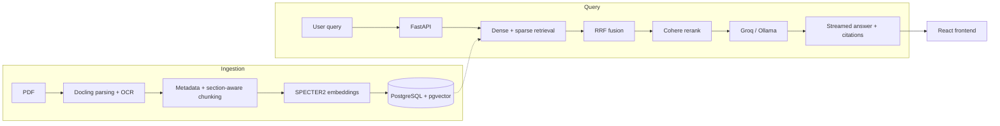

# Anthology

Anthology is a RAG (retrieval-augmented generation) app for asking questions over a collection of research papers. You upload PDFs, it parses and chunks them, embeds the chunks, and answers questions by retrieving relevant passages and passing them to an LLM — with streamed, cited responses. It's built with FastAPI, PostgreSQL/pgvector, and React. The more interesting part isn't the LLM call itself, it's the retrieval pipeline (hybrid dense + sparse search, fused and reranked) and the fact that it's actually evaluated — internally, and separately against a real external dataset (QASPER) — with the results reported as-is, including the parts that aren't flattering.

## How it works



## Results

The retrieval pipeline is evaluated two different ways, and they're not really comparable.

Internally, on 247 questions generated from the corpus itself, hybrid retrieval + rerank gets **Hit@1 = 77.3%, Hit@5 = 85.8%, MRR = 81.7%** — the best of the strategies tried.

Externally, against QASPER's validation split (281 papers, 892 answerable questions), everything scores noticeably lower, and plain BM25 actually beats the SPECTER2 dense embeddings:

- dense (SPECTER2): Hit@1 0.128, Hit@5 0.230, MRR 0.178
- BM25: Hit@1 0.221, Hit@5 0.353, MRR 0.281
- hybrid RRF: Hit@1 0.197, Hit@5 0.370, MRR 0.272

The internal benchmark measures which strategy works best *on this corpus*; QASPER measures how the same code holds up on a harder, external dataset with a different question style. BM25 beating dense retrieval here is specific to QASPER, not a general claim about either method — it's just what was actually measured.

Current corpus: 121 papers, 11,889 chunks. 44/44 tests pass locally.

## Resume highlights

- Built an end-to-end RAG system (FastAPI, PostgreSQL/pgvector, React) that ingests PDFs and answers questions with streamed, citation-grounded responses.
- Implemented hybrid retrieval — dense + sparse search fused with RRF and reranked with Cohere — reaching 77.3% Hit@1 on a 247-question internal benchmark.
- Ran a separate external evaluation against QASPER (281 papers, 892 questions) to check generalization, and reported the result honestly even where BM25 beat dense retrieval.
- Deployed as a 5-service Docker Compose stack with CI running 35 automated tests (44 pass locally).

## Running locally

```bash
git clone https://github.com/Rupinder51120/Anthology.git
cd Anthology
cp .env.example .env
docker compose up -d
```

Run the tests:

```bash
pytest tests/
```
